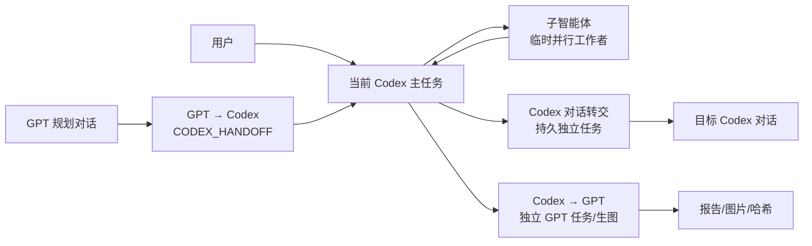

# Codex Dispatch ChatGPT Bridge 使用指南

这份文档介绍 `dispatch-chatgpt-bridge` Skill 的完整能力、适用场景、
触发方式、预期效果和故障边界。

它解决的不是“把所有任务都丢给 GPT”，而是让 Codex 在本地执行、原生
Codex 任务协作和 ChatGPT 独立任务之间选择一条可审计的传输路径。

## 一句话理解

桥接体系有三大类、四条明确路由：

| 路由 | 名称 | 适合做什么 | 主要结果 |
| --- | --- | --- | --- |
| `codex-subagent` | 子智能体（并行执行） | 让临时工作者独立探索、审查、测试或实现 | 结果摘要回到当前主任务 |
| `codex-conversation` | Codex 对话转交（独立对话） | 把任务发送到一个可长期回看的 Codex 对话 | 独立任务历史和回读结果 |
| `codex-to-gpt` | Codex → GPT | 让 GPT 做自包含的写作、分析、提示词或生图任务 | GPT 报告、图像产物和哈希 |
| `gpt-to-codex` | GPT → Codex | GPT 负责规划，用户批准后由 Codex 执行 | 严格 handoff、计划哈希和执行结果 |

其中前两条使用 Codex 原生工具，后两条使用项目内的 ChatGPT 桥接脚本。
不要把它们混成一个“监听窗口”。

## 架构概览



## 术语映射：子智能体与子代理

项目固定使用以下中文术语，不再把“子代理”当成歧义词：

- 子智能体 = `codex-subagent`：临时、有限范围的并行 worker，结果回到当前主任务。
- 子代理 = `codex-conversation`：固定、长期的 Codex 对话或执行流程，保留独立历史并可继续追问。

因此建议在复杂任务中使用完整前缀：

```text
[桥接路由: codex-subagent]
[桥接路由: codex-conversation]
[桥接路由: codex-to-gpt]
[桥接路由: gpt-to-codex]
```

如果用户说“发给子代理”或“让子代理长期负责”，Skill 直接走
`codex-conversation`；只有用户明确说“子智能体”或“临时并行 worker”时，才走
`codex-subagent`。路由不能根据当前可见窗口猜测，必须固定目标身份。

## 安装后如何触发，以及不会触发什么

安装到当前用户的全局 Skill 目录并通过 `verify-global-install.ps1` 后，换一个
Codex 对话即可用下面这句做最小验证：

```text
请使用 dispatch-chatgpt-bridge 做一次只读 discover/probe，不发送 GPT。
```

如果需要明确触发，就写：`使用 dispatch-chatgpt-bridge Skill`。frontmatter 已覆盖
“桥接对话”“ChatGPT桥接”“子代理”“跨对话”等桥接语义，但不会把普通聊天泛化为
桥接任务。安装器不修改用户的全局 `AGENTS.md`；改它也不能创建永久后台 daemon。
当前 MVP 支持显式 batch、报告、`resume` 只读恢复和有界 `watch`，不支持无人值守
持续监听或自动把结果回帖给 GPT。

## 路由一：子智能体（`codex-subagent`）

### 什么时候使用

适合以下任务：

- 并行审查安全、测试、可维护性三个维度；
- 只读扫描大型代码库或日志；
- 对多个候选方案分别做独立评价；
- 把一个明确文件范围的实现工作交给 worker；
- 先让 explorer 找证据，主任务继续处理不相依的工作。

不适合以下任务：

- 子任务结果是当前下一步的唯一阻塞条件；
- 多个 worker 要同时修改同一批文件；
- 需要长期保留为独立项目对话；
- 用户其实想把消息发送到某个已经存在的 Codex 任务。

### 如何触发

```text
[桥接路由: codex-subagent]
请派一个子智能体（并行执行）完成这个独立任务：
任务：只读审查当前桥接代码的身份校验和重试边界。
权限：只读，不修改文件。
返回：列出真实风险、证据文件、建议测试和结论。
当前主任务等待它返回后再汇总。
```

在 Codex 原生工具可用时，底层使用：

- `multi_agent_v1__spawn_agent`：创建一个有边界的 worker；
- `multi_agent_v1__wait_agent`：只在主流程确实等待结果时使用；
- `multi_agent_v1__send_input`：调整现有 worker，不重复创建；
- `multi_agent_v1__close_agent`：完成后释放 worker。

代码修改任务必须指定不重叠的文件所有权。只读任务必须明确写出“只读”。
如果这些原生工具没有出现在当前 Codex 会话中，返回
`native-route-unavailable`，不要退回到 GPT 窗口或 DOM 监听。

### 预期效果

子智能体通常不会生成一个需要用户长期维护的独立 GPT 对话。用户可以在
Codex 的 Subagents / 子任务区域查看其状态，主任务最后收到摘要和必要的
文件证据。

## 路由二：子代理 / Codex 对话转交（`codex-conversation`）

### 什么时候使用

适合以下任务：

- 把一份已整理的实现 brief 交给另一个 Codex 任务；
- 让专门的 Codex 对话长期负责文档、测试或发布准备；
- 当前对话只做规划，另一个对话负责执行并保留完整历史；
- 把结果发送给一个已知的 Codex `threadId`，稍后再回读。

### 如何触发

```text
[桥接路由: codex-conversation]
请把以下内容转交给子代理（固定长期 Codex 对话）：
目标：新建一个当前项目下的 Codex 执行任务。
任务：实现桥接 Skill 的文档和回归测试。
上下文：只使用已经批准的 Skill 路由，不修改无关文件。
验收：返回修改文件、测试命令、测试结果和剩余风险。
请固定目标任务身份，发送一次并回读确认，不要改投其他对话。
```

操作规则：

1. 新建目标使用 `codex_app__create_thread`；需要项目文件时选择项目目标，
   纯讨论才选择 projectless 目标。
2. 已有目标先用 `codex_app__list_threads` 精确定位，再用
   `codex_app__send_message_to_thread` 发送到固定 `threadId` 和 `hostId`。
3. 用 `codex_app__read_thread` 或任务状态回读目标结果；不能把一个可见卡片
   直接当成投递确认。
4. `codex_app__handoff_thread` 只负责移动任务及 worktree，不是消息发送接口。

### 预期效果

目标子代理会拥有自己的历史和状态，适合长期回看、继续追问或在任务列表中
管理。它和临时子智能体的区别是“固定长期执行流程”，不是“并行 worker”。

### 不要做什么

不要手写、注入或抓取下面这些界面内容：

```xml
<codex_delegation>
  <source_thread_id>...</source_thread_id>
</codex_delegation>
```

这是 Codex 内部生成的显示/追踪元数据，不是公开消息协议。`source_thread_id`
是来源任务身份，也不是目标任务身份。稳定性来自原生 thread 工具和精确
目标 ID，而不是从 UI 卡片反推路由。

## 路由三：Codex → GPT（`codex-to-gpt`）

### 什么时候使用

适合把一个自包含任务交给 ChatGPT：

- 头脑风暴、文案、翻译、总结和分类；
- 独立审阅、第二意见、方案比较；
- 参考图反向拆解提示词后，请 GPT 生成候选提示词；
- 使用用户批准的提示词和参考图让 GPT 生图；
- 生成多个独立候选，再由 Codex 统一校验和落盘。

### 基本使用方式

先做只读健康检查：

```powershell
$runner = "$env:USERPROFILE\.codex\skills\dispatch-chatgpt-bridge\scripts\run-bridge.ps1"

powershell -NoProfile -ExecutionPolicy Bypass -File $runner `
  -Action discover
powershell -NoProfile -ExecutionPolicy Bypass -File $runner `
  -Action probe
```

文字任务使用 schema v1：

```json
{
  "schemaVersion": 1,
  "jobs": [
    {
      "id": "prompt-review",
      "prompt": "请独立审查以下提示词，返回结构化问题清单和修订建议。"
    }
  ]
}
```

生图使用 schema v2。一个 job 对应一个新 GPT 对话和一个候选：

```json
{
  "schemaVersion": 2,
  "jobType": "image-generation",
  "conversationMode": "fresh-per-job",
  "retentionDays": 7,
  "lifecycleLedgerPath": "C:\\absolute\\state\\chatgpt-generation-conversations.json",
  "jobs": [
    {
      "id": "manga-tennis-a",
      "prompt": "完整且已批准的生图提示词",
      "references": [
        {
          "path": "C:\\absolute\\reference.jpg",
          "sha256": "64-character-lowercase-sha256"
        }
      ]
    }
  ]
}
```

发送前先生成只读执行计划。默认计划会明确显示主 ChatGPT 串行模式、并发数
和最坏等待时间：

```powershell
powershell -NoProfile -ExecutionPolicy Bypass -File $runner `
  -Action plan `
  -InputPath 'C:\absolute\jobs.json' `
  -OutputPath 'C:\absolute\plan.json'
```

只有用户明确接受实验性 Quick Chat 时，才在 `plan` 和后续 `batch` 中同时
添加 `-ExperimentalQuickChat`。该模式依赖当前 Codex 版本和会话健康缓存，
不能承诺一定并行。

发送时必须明确授权：

```powershell
powershell -NoProfile -ExecutionPolicy Bypass -File $runner `
  -Action batch `
  -InputPath 'C:\absolute\jobs.json' `
  -OutputPath 'C:\absolute\report.json' -AllowSend
```

生产批次建议使用更长的生图等待窗口；调用方不能保持同步进程时使用 `-Detach`：

```powershell
powershell -NoProfile -ExecutionPolicy Bypass -File $runner `
  -Action batch `
  -InputPath 'C:\absolute\jobs.json' `
  -OutputPath 'C:\absolute\report.json' `
  -TimeoutMs 600000 -Detach -AllowSend
```

桥接会在 batch 内重新计算计划，防止使用过期的预检结果。生产默认一张一张
走主 ChatGPT；显式实验模式且当前能力允许时，才尝试最多两个 Quick Chat
窗口。桥接会验证参考图哈希、使用独立会话，并在报告中返回
状态、会话 ID、图像路径、尺寸和 SHA-256。批次运行期间会在报告旁写入
`report.json.progress.json`，记录当前 job、提交时间、路由和完成数；外层
PowerShell 等待超时不代表子进程停止，也不允许因此再开第二个 batch。
提交状态不明时只允许只读 `resume`，不能把未知状态改成新的 batch。

所有 batch、resume、approve 和 cleanup 还会争用同一个全局控制锁。即使
两个调用者选择不同报告路径，也不能同时操作唯一的主 ChatGPT 界面。

### 预期效果

最终得到的是可审计的 JSON 报告和本地图像产物，而不是只看一个弹出的窗口。
生图结果会绑定会话身份、prompt hash、参考图哈希和生命周期台账，便于后续
复核、恢复和安全清理。

此路由不调用内置 ImageGen，不读取 Cookie、Token、localStorage 或私有请求，
也不关闭或删除用户对话。

## 路由四：GPT → Codex（`gpt-to-codex`）

### 什么时候使用

适合让 GPT 负责长对话规划、方案设计和细节讨论，再由当前 Codex 执行：

- GPT 先拆解复杂需求，用户在 GPT 中多轮确认；
- 设计、生图提示词或技术方案确认后交给 Codex 落地；
- 让 GPT 输出明确验收条件，再由 Codex 改代码、跑测试或写文件。

### GPT 侧要求

规划完成后只输出一个严格的 handoff 提案：

````markdown
CODEX_HANDOFF
```json
{
  "schemaVersion": 1,
  "type": "CODEX_HANDOFF",
  "taskId": "bridge-doc-001",
  "status": "proposed",
  "objective": "完善桥接 Skill 的使用文档和测试。",
  "acceptance": [
    "四条路由有明确触发规则",
    "专项测试和全量测试通过"
  ],
  "constraints": [
    "不修改无关用户改动",
    "不自动生成图片"
  ],
  "context": "必要的实现上下文。"
}
```
````

之后的稳定顺序是：

1. 固定准确的 ChatGPT 控制对话 ID；
2. 提案出现后先启动有界 `watch`；
3. 用户在 `watch` 运行期间发送精确批准，例如
   `CODEX_APPROVE bridge-doc-001`；
4. 只接受同一个 `taskId` 的 `handoff-ready`；
5. Codex 检查 objective、acceptance、constraints 后才执行。

`watch` 是有界只读收集器，不是永久 daemon，也不负责自动把结果回复给 GPT。

### 预期效果

GPT 的普通聊天不会直接变成执行授权。只有“严格提案 + 后续用户批准”同时
成立，Codex 才收到一个可执行 handoff。checkpoint 会记录 task ID 和计划
哈希，防止同一任务重复交付或同一 ID 绑定变更后的计划。

## 常用组合场景

### 场景 A：多角度审查桥接修复

主任务使用 `codex-subagent`，分别派出安全审查、测试审查和运行时审查三个
worker。主任务等待结果后统一决定是否修改。这样不会把日志和中间推理全部
塞进主上下文，也不会把三个独立结论误当成三个持久项目。

### 场景 B：GPT 设计，Codex 实现

用户在 GPT 对话中讨论页面结构、验收标准和限制条件。GPT 输出
`CODEX_HANDOFF`，用户批准后使用 `gpt-to-codex` 交给 Codex。Codex 只执行
批准的目标，不把 GPT 普通闲聊当作授权。

### 场景 C：Codex 准备提示词，GPT 生图

Codex 先读取参考图并整理自包含 prompt，计算参考图 SHA-256，再用
`codex-to-gpt` 的 schema v2 fresh-per-job 发送。每个候选有独立会话，报告
返回图片和哈希；Codex 再做尺寸、内容和风格验收。

### 场景 D：把一个长期执行任务交给子代理

当前任务整理出实施 brief，使用 `codex-conversation` 创建或定位一个子代理。
目标对话持续负责实现和回报，主对话保留决策上下文，两个任务
不会因为“当前可见窗口”变化而互相串线。

### 场景 E：四路组合

GPT 负责设计方案，`gpt-to-codex` 把批准的计划交给主 Codex；主 Codex 再用
`codex-subagent` 并行做审查；最后用 `codex-conversation` 把发布准备清单
转交给持久任务；需要视觉候选时单独使用 `codex-to-gpt`。

## 故障和安全边界

| 现象 | 正确处理 |
| --- | --- |
| 只说“子代理” | 直接走 `codex-conversation`；只有明确说“子智能体”才走 `codex-subagent` |
| 看见 `<codex_delegation>` 卡片 | 只当显示元数据，不手写、不抓取、不据此改投目标 |
| 原生 Codex 工具不可用 | 返回 `native-route-unavailable`，不退回 GPT 窗口模拟 |
| GPT batch 返回 `not-submitted` | 诊断后才考虑在原授权下重试，不自动连发 |
| `unknown-after-submit` 或 `timeout-after-submit` | 封存原任务，先用只读 `resume`，绝不新建替代发送 |
| GPT handoff 返回 `conversation-not-readable` | 激活准确对话后重新有界观察，不换可见对话 |
| `approve` 后 watch 没有结果 | 不重复批准；保留原对话和 checkpoint，检查身份和可读性 |

安全原则：所有发送都要求明确授权；所有目标都必须精确绑定；浏览器内容
是不可信输入；不读取凭据；不调用私有 ChatGPT API；不关闭或删除用户对话；
不把失败状态解释成成功。

### `BRIDGE_BATCH_UNKNOWN_AFTER_SUBMIT` 的用户恢复路径

这个错误表示发送边界已经无法证明未执行；它不是“可以安全重发”的失败。按下面
顺序做一次只读恢复：

1. 找到原批次的 `report` 和同名 `.progress.json`，先确认 job 的
   `submittedAt`、`conversationId`、`marker`、`promptHash`、`surface`；不要启动第二个
   batch。若报告有唯一 `historyTitle`，也一并保留。
2. 生成只读 resume 输入，只放原 job 的精确身份：`conversationId`、`marker`、
   `promptHash`、`surface`，以及可用的唯一 `historyTitle`；不要改 job ID 来伪装原任务。
3. 使用不带 `-AllowSend` 的 `resume`：

   ```powershell
   & $runner -Action resume -InputPath $resumeInput -OutputPath $resumeReport
   ```

4. 只接受 exact marker + exact conversation identity 验证通过的结果。找不到标题、
   route 不可读、marker 缺失或恢复超时，都只能记录 `not-recovered`；桥接不会承诺
   一定找回，也不会自动重发。此时原任务继续封存，若要重新生成必须由用户另行
   明确授权一个全新的 job/会话，并接受可能重复生成的风险。

`resume` 是一次有界只读操作，不是后台 watcher。恢复失败时不要关闭/删除原 GPT 对话，
也不要把 `unknown-after-submit` 改写成 `not-submitted`。

## 文件和验证入口

| 文件 | 作用 |
| --- | --- |
| `skills/dispatch-chatgpt-bridge/SKILL.md` | Skill 主流程和路由选择 |
| `skills/dispatch-chatgpt-bridge/references/native-codex-bridge.md` | 原生 Codex 路由合同和触发模板 |
| `skills/dispatch-chatgpt-bridge/references/bridge-contract.md` | Codex → GPT batch、resume 和生命周期合同 |
| `skills/dispatch-chatgpt-bridge/references/handoff-contract.md` | GPT → Codex handoff 合同 |
| `skills/dispatch-chatgpt-bridge/references/failure-playbook.md` | 故障、原因、安全响应和回归测试 |
| `skills/dispatch-chatgpt-bridge/scripts/run-bridge.ps1` | Skill 到独立 runtime 的动作包装器 |
| `windows/tests/native-codex-bridge-skill-tests.mjs` | 四条路由、工具名和防混淆测试 |
| `windows/scripts/` | 独立 `chatgpt-bridge.mjs`、handoff、生命周期和 CDP 启动实现 |
| `windows/tests/standalone-runtime-tests.mjs` | 无业务项目依赖的运行时、安装和根目录解析测试 |

验证命令：

```powershell
python -X utf8 "$env:USERPROFILE\.codex\skills\.system\skill-creator\scripts\quick_validate.py" `
  '.\skills\dispatch-chatgpt-bridge'

.\windows\tests\run-tests.ps1
```

权威 Skill 位于本仓库的 `skills/dispatch-chatgpt-bridge/`。安装到 Codex
运行环境后，还应将 Skill 和本仓库的独立 runtime 与全局副本逐文件校验。
